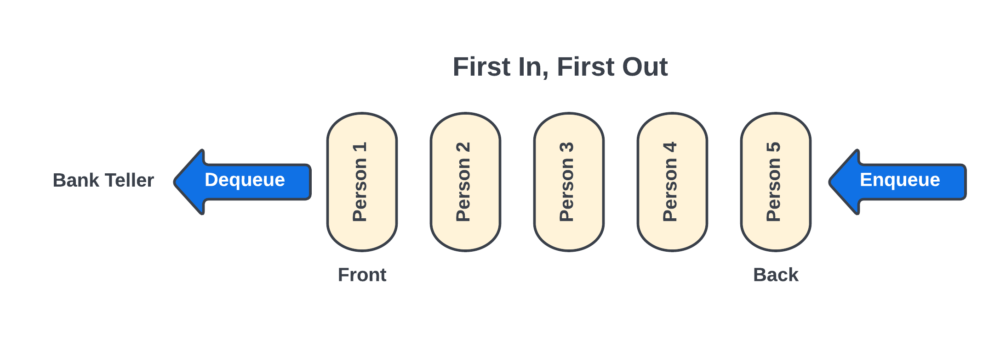

# Queues
A queue is data structure that allows the user to organize and store data in a "First In, First Out" (FIFO) configuration. This data structure is commonly represented as a line of people waiting to be served. In this arrangement, the person who joined the line first is the one who is served first. This data structure is useful whenever we want to process a group of requests or data in order of arrival. Some common queue applications are routers, print management, interrupts handling on some operating systems, or website traffic handling, among others.

## Structure
In order to understand the structure of a queue, we can consider the following example: <br> 
<br> 
Imagine that there are several people in line at a bank ready to be served. The person who joined the line the earliest is called the **front**, and the person who joined the line the last is called the **back**. When the person at the front of the line is served, and therefore removed from the queue, we call this operation **dequeue**. When a new person arrives at the bank and lines up, we call this operation **enqueue**.
<br> 
<br> 

<figcaption align = "center"><b>Figure 1 - Queue</b></figcaption>
<br> 
A queue is fairly simple data structure, but it can be a powerful tool when using adequately.

<br> 

## Reading From and Writing to a Queue
Whenever we want to read from a queue, we can implement a line of code like this:

<br> 

```python
#This line of code deletes the item in the front of the queue and store it in a variable

data = list.pop(0)

#Another way to implement this same operation would be

data = list[0]
del list[0]

```

This would allow us to dequeue the front value and store it in a variable. Once the value is stored in a variable, we can use this variable for any other operations needed.
<br> 
<br> 
Whenever we want to write to a queue, we can implement the following line of code: 

```python
#This line of code appends a new item to the back of the queue

list.append(item)

```
This would allow us to enqueue a new value to the back of the queue.

<br> 

## Python Syntax
As we could see in the previous section, a queue can be implemented on Python by using a list. 
The following pieces of code can be used to implement a queue in Python:
<br> 

* >``` list.append(item) ```: It adds a new item to the back of the queue
* >``` data = list.pop(0) ```: It removes and return the item at the front of the queue
* >``` length = len(list) ```: It returns the size of the queue
* >``` if len(list) = 0 ```: It checks if the queue is empty. If it's, it returns true


## Example: Printer Manager
In the example below, we will write a simple Printer Manager program, which will use a class to implement a queue. Every time this class is called, a list will be created where the elements of the queue will be added. The requirements for the software are the following:

* Allow the user to add files to the queue to be printed. Maximum amount of files allowed is 10
* Simulate the behavior of a printer while printing and dequeue the files already printed
* Print the name of files already printed
* Create a method that returns the size of the queue in order to use that value for the logic of the code

```python
class Printer_Queue:
    def __init__(self) -> None:
        self.printing_order = []
        self.max_size = 10

    def enqueue(self, file_name):
        if len(self.printing_order) <= self.max_size:
            self.printing_order.append(file_name)
        else:
            print("\nQueue is full. No more file can be added. Please enter 0 when the program ask you if you want to add more files")
    
    def dequeue(self):    
        return self.printing_order.pop(0)
    
    def len(self):
        return len(self.printing_order)

list_of_orders = Printer_Queue()

request = 1
exit_menu = "no"

while exit_menu == "no":
    print("Printing Menu: ")
    print("1) Add files to print")
    print("2) Proceed to print")
    print("3) Exit")
    operation = int(input("\nSelect operation: "))

    if operation == 1:
        while request == 1:
            file_name = input("\nPlease introduce the name of the file you want to print: ")
            list_of_orders.enqueue(file_name)
            request = int(input("\nDo you want to print another file? (Enter 1 for yes and 0 for no): "))

    elif operation == 2:
        print()
        while list_of_orders.len() != 0:
            served_print = list_of_orders.dequeue()

            for x in range(30000000):      #Simulate a clock for the print time
                pass

            print(f'>>>The file called "{served_print}" was already printed')
    
    elif operation == 3:
        exit_menu = "yes"
    
    print()
```
## Problem to Solve: Music Playlist Creator Software
Write a program that implement a queue to create a songs playlist with a maximum of 20 songs. This should allow the user to add new songs to the playlist and dequeue songs that were already played. The general instructions for the program are:
* Create a class that contains a queue for the playlist with a maximum size of 20
* Create a class inside the queue class that contains the information of each song (name, artist, and duration) 
* Create a method inside the song class called `__str__ ` that return the string structure in which the dequeued songs will be print. It should print the name of the song with the artist and duration
* Create a method that allows  to enqueue songs to the playlist. It should print a message when the maximum number of songs is reached
* Create a method that allows to dequeque songs from the paylist
* Create a method called `len()` that returns the size of the queue to use its value for the logic of the code. `hint:` look at the print management example.
* Create a method that prints the amount of time (in minutes) that it will take until an specific song can be played
* Display a menu that allow the user add songs by name to the playlist, play (print) songs from playlist and calculate and print time until an specific song will be played. `hint:` again look at the print management example. It will give you an idea of how to create and display a menu.

Remember that there are many ways to implement the same idea; therefore, your program shouldn't necessarily be exactly the same as our solution. Also, you will need to apply the knowledge you have acquired about object-oriented programing.

You can test your program with the following scenarios:

* Test 1: Add the name of 20 songs and play songs from playlist. You might use the table found at the end of this page with some songs, their artist and duration. **Expected outcome:** Print the name of the 20 songs, in the order that were added, with the name of the artist and duration.
* Test 2: Add the name of the same 20 songs again + 1 extra song. **Expected outcome:** Print a message when the maximum number of songs is reached
* Test 3: Ask for the amount of time that will elapse until the song "An Angel from on High" is played. The songs should be added in the same order as in the table. **Expected outcome:** Print song's duration. It should be 34.74 minutes. 


| **Name of the Song**                  | **Artist**                 | **Duration (in minutes)** |
|---------------------------------------|----------------------------|--------------|
| The Morning Breaks                    | Parley P. Pratt            | 03.25        |
| The Spirit of God                     | William W. Phelps          | 05.90        |
| Now Let Us Rejoice                    | William w. Phelps          | 03.45        |
| Truth Eternal                         | Parley P. Pratt            | 02.02        |
| High on the Mountain Top              | Joel H. Johnson            | 02.52        |
| Redeemer of Israel                    | William W. Phelps          | 04.15        |
| Israel, Israel God is Calling         | Richard Smyth              | 03.85        |
| Awake and Arise                       | Theodore E. Curtis         | 02.50        |
| Come, Rejoice                         | Tracy Y. Cannon            | 02.55        |
| Come, Sing to the Lord                | Gerrit de Jong Jr.         | 02.25        |
| What Was Witnessed in the Heavens?    | John S. Davis              | 02.30        |
| An Angel from on High                 | Parley P. Pratt            | 04.42        |
| Sweet is the Peace the Gospel Brings  | Mary Ann Morton            | 03.58        |
| I Saw a Mighty Angel Fly              | Ralph Vaughn Williams      | 02.38        |
| What Glorious Scenes Mine Eyes Behold | Ebenezer Beesley           | 03.68        |
| Awake Ye Saints of God, Awake         | Eliza R. Snow              | 03.13        |
| The Voice of God Again Is Heard       | Evan Stephens              | 02.10        |
| We Thank Thee O God, For a Prophet    | William Fowler             | 02.75        |
| God of Power, God of Right            | Wallace F. Bennett         | 01.95        |
| Come, Listen to a Prophet's Voice     | Joseph S. Murdock          | 03.18        |
| We Listen to a Prophet's Voice        | Marylou Cunningham Leavitt | 02.9        |


You can check your work with the solution here: [Solution](playlist_handler.py)

[Back to Welcome Page](1-welcome.md)