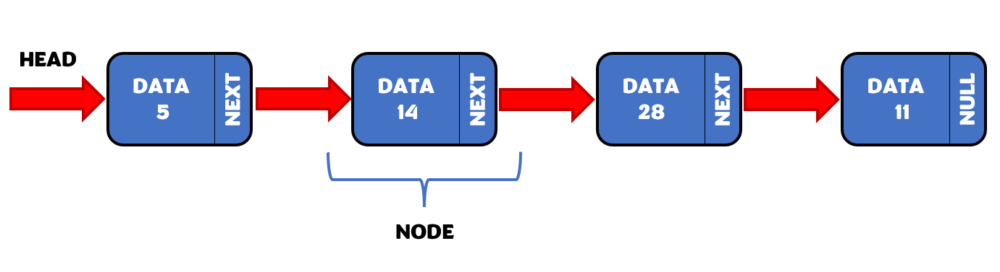
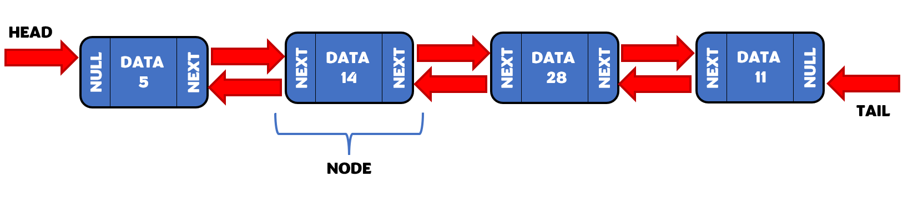
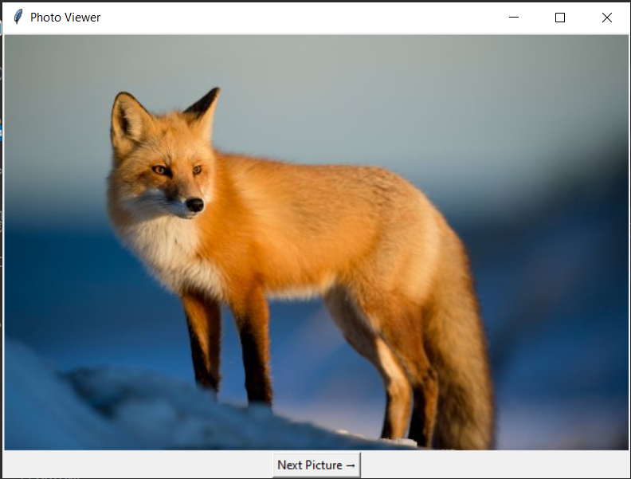

# Linked Lists
Sometimes when creating an array, it's hard to know how many items we will include in our array or the right order in which we want to insert the items since the beginning of our project. In such situations, it's very common change our mind or make mistakes and we want to have an easy way to add or delete elements that are not necessary in the beginning or the end of our array. Maybe we want to do it in the middle of our arrangement. If this is our thinking, not many data structures give us this flexibility to easily add elements into our array. However, **Linked lists** allows us to collect data and stored it in memory in a random way. This data structure guarantees us that each element in the list will be stored in some place in memory but not each element will necessarily located in the address next to another element. To understand how it's possible that this data structure keep all the items in the list together, you can read the next section. 

<br> 

## Structure
There are two possible structures a linked list can have. The first type is shown in Figure 2. For this one, each element, also referred as **node**, has an associated **value** and a **pointer** to the address in memory of the **next node** in the list. Usually, the first element in the linked list is called **head**.

<br> 


<figcaption align = "center"><b>Figure 2 - Linked List</b></figcaption>

<br> 

The second structure that a linked list can have is shown in Figure 3. This one is generally called **doubly-linked list** due to its bi-directional linking property. As you can see in the figure, this arrangement not only has a head but also has a **tail** which is the last element in the list. It additionally counts with pointers to both the address in memory of the next node and **previous node**.



<figcaption align = "center"><b>Figure 3 - Doubly-Linked List</b></figcaption>

<br> 

A powerful property this data structure has is the ability to traverse through the list until we get to the node we want to use for a certain operation. In order to this, it's necessary to know where the head or tail are; that way, we can traverse or reverse traverse until we get to the specific pot where we want to add a new node or remove a node.

<br> 

## How to Insert, Remove and Access Data From a Linked List
The three main operations that can be performed with liked lists are inserting data, removing data and accessing to the data in the list. We will first focus on inserting data to a linked list. 

Inserting a new node in a linked list can be done at the head, tail or middle. Due to that pointers allows us to connect a new node to the next or previous node, the size of the list is not a problem when using this data structure. The processes of inserting at head and tail are very similar. Inserting in the middle can differ from the other two slightly.

### Create a linked list and a new node:
```python
# Linked lists can be implemented in Python by using classes. 
# In case we want to initialize an empty list, we can do it inside the __init__() method declaration of the class.

def __init__(self):
    self.head = None
    self.tail = None

#A new node can be created as an atribute inside a class within the other class

def __init__(self, data):
    self.data = data
    self.next = None
    self.prev = None

```

<br> 

### Insert a new node in the head: 
```python
# Connect the "next" of the new node to the current head
new_node.next = self.head 

# Connect the "prev" of the current head to the new node
self.head.prev = new_node

# Update the head to point to the new node
self.head = new_node

# SPECIAL CASE
# If linked list is empty, we could just set the head and tail to the new node
if self.head is None:
    self.head = new_node
    self.tail = new_node
```

<br> 

### Insert a new node in the tail: 
```python
# Connect the "prev" of the new node to the current tail
new_node.prev = self.tail 

# Connect the "next" of the current tail to the new node
self.head.prev = new_node

# Update the tail to point to the new node
self.head = new_node
```

<br> 

### Insert a new node in the middle: 
```python
# Connect the "prev" of the new node to the current node
new_node.prev = current 

# Connect the "next" of the new node to the next node after current node
new_node.next = current.next

# Connect the "prev" of the next node after current to the new node
current.next.prev = new_node

# Connect the "next" of the current node to the new node
current.next = new_node
```

<br> 

Removing a node from a linked list can also be done at the head, tail and middle.
### Remove a node from the head: 
```python
# Set the "prev" of the node next to the current head to None
self.head.next.prev = Node

# Update the head to point to the node next to the current head
self.head = self.head.next

# SPECIAL CASE
# If only one node in the list, set the head and tail to None
self.head = None
self.tail = None

```

<br> 

### Remove a node from the tail: 
```python
# Set the "next" of the node previous to the current tail to None
self.tail.prev.next = Node

# Update the tail to point to the node previous to the current tail
self.tail = self.tail.prev
```

<br> 

### Remove a node from the middle: 
```python
# Connect the "prev" of the node after current to the node before current
current.next.prev = current.prev

# Connect the "next" of the node before current to the node after current
current.prev.next = current.next
```

<br> 

Whenever we want to access to data in the list, we need to traverse the list starting by the head or the tail. This can be done by using a while loop and following the "next" or "prev" linked node until we get to the value we are trying to find or the end of the list.

### Access a node from the linked list: 
```python
# Check if an specific value is in the list
def find_value(self, value):

    # Whenever we want to start at the head
    current = self.head

    # Loop as long as we haven't reach the value we want
    while current is not value:
        
        # Point to the next node
        current = current.next

    # Print the value once it's found
    print(current.data)
```
If we want to loop through the list starting at the tail we just need to change the lines of code  `current = self.head` to `current = self.tail` and `current = current.next` to `current = current.prev`.

<br> 

## Python Syntax
Besides the methods previously mentioned for the implementation of the linked list, Python also has a built-in linked list already. The commands to use this linked list are the following:

* >``` linked_list = deque() ```: It creates a empty linked list
* >``` linked_list.appendleft(value) ```: It inserts a new head
* >``` linked_list.append(value) ```: It inserts a new tail
* >``` linked_list.insert(i, value) ```: It inserts a new value after the node "i"
* >``` data = linked_list.popleft() ```: It removes the head and stores it in a variable
* >``` data = linked_list.pop() ```: It removes the tail and stores it in a variable
* >``` del linked_list[i] ```: It removes a value in the middle of the list
* >``` length = len(list) ```: It returns the size of the linked list
* >``` if len(list) = 0 ```: It checks if the linked list is empty. If it's, it returns true

## Example: Photo Viewer Software Using a Linked List
In the example below, we will write a program that create a linked list with pictures that will be display with a Photo Viewer software. This linked list will allow the user to add and delete pictures to the list in the order the user wishes; therefore, the program should allow the user to add or delete at the beginning, middle or end of the list. Despite that there is already a built-in class on Python to create a linked list, we will use our knowledge on object-oriented programming to come up with our own class to do this. The specifications for the program are the following:
* Allow the user to add new pictures to the beginning or end of the linked list
* Allow the user to add new picture after another specific old picture
* Users will need to add a picture to the linked list by using the name of the file they want to add. Adding the file type is not necessary. `Example:` fox. Users need to make sure that the picture is in the same folder where they have saved this program. Otherwise, they will need to edit the path of the picture.
* Allow the user to delete pictures at the beginning, end or middle of the linked list
* Display the linked list with all the pictures by using a Photo Viewer software created using GUI imported classes, starting with the first picture in the linked list.  Create a "Next Picture" button that allows the user to go to the next picture in the linked list.
* Print a message when the user tries to delete a picture from an empty list
* Don't allow user to add pictures that are already in the list. Print a message telling the user to add another image
* Allow user to replace an old picture with a new picture
* Create a menu that allows the user to select the different operations that can be done with the linked list
* Create an option to exit the menu

<br> 

```python

# Import a standard Python interface with GUI(Graphical User Interface)
from tkinter import *
# Import Python private library that allows to add images to GUI
# In order to be able to use this library, you need to install it by typing 'pip install Pillow' on the terminal
from PIL import ImageTk, Image

# Create a clas that contains a linked list with pictures
class PhotoViewer:
    # Create a class that contains each picture name as a node
    class Picture:
        def __init__(self, picture_name):
            self.picture_name = picture_name
            self.next_picture = None
            self.prev_picture = None
          
    # Create a empty linked list
    def __init__(self):
        self.first_picture = None
        self.last_picture = None
    
    # Method that allows to add a new picture at the front of the list
    def add_picture_at_front(self, picture_name):
        new_picture = PhotoViewer.Picture(picture_name)
        # If list is empty, add new picture at the front of the list
        if self.first_picture == None:
            self.first_picture = new_picture
            self.last_picture = new_picture
        #Otherwise, replace old picture at the front of the list by the new picture
        else:
            self.first_picture.prev_picture = new_picture
            new_picture.next_picture = self.first_picture
            self.first_picture = new_picture

    # Method that allows to add a new picture at the end of the list
    def add_picture_at_end(self, picture_name):
        new_picture = PhotoViewer.Picture(picture_name)
        # If list is empty, add new picture at the front of the list
        if self.first_picture == None:
            self.first_picture = new_picture
            self.last_picture = new_picture
        #Otherwise, replace old picture at the end of the list by the new picture
        else:
            self.last_picture.next_picture = new_picture
            new_picture.prev_picture = self.last_picture
            self.last_picture = new_picture

    # Method that allows to add a new picture after another specific old picture
    def add_picture_after(self, add_after, picture_name):
        # Loop through the list, starting at the first picture
        current_picture = self.first_picture
        # Keep looping as longh as the current picture exists
        while current_picture is not None:
            # Check if current picture is equal to the old picture. If it's, add new picture after this old picture
            if current_picture.picture_name == add_after:
                # Check if current picture is equal to the last picture in the list
                if current_picture.picture_name == self.last_picture.picture_name:
                    self.add_picture_at_end(picture_name)   # Add new picture at the end of the list
                # Otherwise, add new picture after the old picture
                else:
                    new_picture = PhotoViewer.Picture(picture_name)
                    new_picture.prev_picture = current_picture
                    new_picture.next_picture = current_picture.next_picture
                    current_picture.next_picture.prev_picture = new_picture
                    current_picture.next_picture = new_picture
            
            # Go to next picture
            current_picture = current_picture.next_picture
    
    # Method that allows to delete a picture from the linked list at the front of the list
    def delete_picture_at_front(self):
        # If linked list only have one picture, delete this picture
        if self.first_picture == self.last_picture:
            self.first_picture = None
            self.last_picture = None
        # If linked list is not empty, delete picture at the front of the list
        elif self.first_picture is not None:
            self.first_picture.next_picture.prev_picture = None
            self.first_picture = self.first_picture.next_picture

    # Method that allows to delete a picture from the linked list at the end of the list
    def delete_picture_at_end(self):
        # If linked list only have one picture, delete this picture
        if self.first_picture == self.last_picture:
            self.first_picture = None
            self.last_picture = None
        # If last picture at the end of the linked list exits, delete this picture
        elif self.last_picture is not None:
            self.last_picture.prev_picture.next_picture = None
            self.last_picture = self.last_picture.prev_picture

    # Method that allows to delete a picture from the linked list at any place in the list or middle
    def delete_picture_in_middle(self, picture_name):
        # Loop through the list, starting at the first picture
        current_picture = self.first_picture
        # Keep looping as longh as the current picture exists
        while current_picture is not None:
            # Check if current picture is equal to the picture is supposed to be deleted. If it's, delete this picture
            if current_picture.picture_name == picture_name:
                # Check if picture is at the front of the list. If it's, delete this picture
                if current_picture.picture_name == self.first_picture.picture_name:
                    self.delete_picture_at_front()
                # Check if picture is at the end of the list. If it's, delete this picture    
                elif current_picture.picture_name == self.last_picture.picture_name:
                    self.delete_picture_at_end()
                # If current picture is different than the first picture, delete this picture
                elif current_picture.picture_name != self.first_picture.picture_name:
                    current_picture.next_picture.prev_picture = current_picture.prev_picture
                    current_picture.prev_picture.next_picture = current_picture.next_picture
                return
            # Go to next picture
            current_picture = current_picture.next_picture
        # If linked list is empty, print this message
        if current_picture == None:
            print("We're sorry but you can't delete the picture. The list is empty")

    # Method that allows to iterate through the linked list. Allow the user to use 'for' loop
    def __iter__(self):
        # Starting from the first student in the linked list, iterate through each picture in the list
        current_picture  = self.first_picture
        # As long as the end of the list is not reached, keep looping
        while current_picture is not None:
            # Return the name of the current picture
            yield current_picture.picture_name
            # Go to next picture
            current_picture = current_picture.next_picture

    # Method that allows to replace an old picture by a new picture
    def replace(self, old_picture, replacement_picture):
        # Loop through the list, starting at the first picture
        current_picture = self.first_picture
        # Keep looping as longh as the current picture exists
        while current_picture is not None:
            # Check if current picture is equal to the old picture. If it's, replace this old picture by new picture
            if current_picture.picture_name == old_picture:
                # Check if old picture is at the front of the list. If it's, replaced this olde picture by new picture
                if current_picture.picture_name == self.first_picture.picture_name:
                    self.delete_picture_at_front()
                    self.add_picture_at_front(replacement_picture)
                # Check if old picture is at the end of the list. If it's, replaced this olde picture by new picture
                elif current_picture.picture_name == self.last_picture.picture_name:
                    self.delete_picture_at_end()
                    self.add_picture_at_end(replacement_picture)
                # Otherwise, replace the old picture (wherever this is) by new picture
                else:
                    add_after = current_picture.prev_picture
                    self.delete_picture_in_middle(current_picture.picture_name)
                    self.add_picture_after(add_after.picture_name, replacement_picture)
                return 
            # Go to next picture 
            current_picture = current_picture.next_picture  

    # Method that allows to check if a picture is already in the linked list. If it's, return True
    def is_in_list(self, picture_name):
        # Loop through the list, starting at the first picture
        current_picture = self.first_picture
        # Keep looping as longh as the current picture exists
        while current_picture is not None:
            # Check if the picture is already in the linked list
            if current_picture.picture_name == picture_name:
                return True
            # Go to next picture
            current_picture = current_picture.next_picture
        # If picture is not in the linked list, return False
        return False

    # Method that allows to display the picture on the screen
    def display_photo_viewer(self):
        # Loop through the list, starting at the first picture
        current_picture = self.first_picture
        # Keep looping as longh as the current picture exists
        while current_picture is not None:
            photo_viewer = Tk()                     # Create a window to display picture
            photo_viewer.title("Photo Viewer")      # Add title to the console
            # Select picture to display
            picture_display = ImageTk.PhotoImage(Image.open(f"CSE_212/{current_picture.picture_name}.jpg"))
            # Display box with selected picture
            picture_label = Label(image=picture_display)
            picture_label.pack()
            # Create a button to display next picture
            next_button = Button(photo_viewer, text="Next Picture →", command=photo_viewer.destroy).pack()
            # Infinte loop to display window
            photo_viewer.mainloop()
            # Go to next picture
            current_picture = current_picture.next_picture
        # If linked list is empty, display the message
        else:
            print("Sorry, the list of picture is empty. There is nothing to display.")


# Create a new picture list
photos_list = PhotoViewer()

exit_menu = "no"

# Create menu that allow user to perform different operations with the linked list
while exit_menu == "no":
    request = 1
    print("Photo Viewer Menu: ")
    print("1) Add picture at beginning or end of the list")
    print("2) Add picture after an specific picture")
    print("3) Delete picture from list")
    print('4) Replace picture by another picture')
    print("5) Display picture in the Photo Viewer")
    print("6) Exit")
    operation = int(input("\nSelect operation: "))

    # Add new picture at the beginning or end of the linked list
    if operation == 1:
        while request == 1:
            picture_name = input("\nPlease introduce the name of the picture you want to add to the list: ")
            picture_name_format = picture_name.lower()
            # Check if picture is already in the linked list. If it's, return message
            if photos_list.is_in_list(picture_name_format):
                print("\nPicture is already in the list. Please add another picture.")
            # Otherwise, add new picture
            else:
                order = int(input("\nDo you want to add pictures at the beginning or end of the list (Enter 1 for beginning or 0 for end)? "))
        
                if order == 1:
                    photos_list.add_picture_at_front(picture_name_format)
                else:
                    photos_list.add_picture_at_end(picture_name_format)
            
                request = int(input("\nDo you want to add another picture at the beginning or end of the list? (Enter 1 for yes and 0 for no): "))

    # Add new picture to the linked list after a specific old picture
    elif operation == 2:
        while request == 1:
            picture_name = input("\nPlease introduce the name of the picture you want to add to the list: ")
            picture_name_format = picture_name.lower()
            # Check if picture is already in the linked list. If it's, return message
            if photos_list.is_in_list(picture_name_format):
                print("\nPicture is already in the list. Please add another picture.")
            # Otherwise, add new picture
            else:
                previous_picture = input("\nPlease introduce the name of the picture after which you want to add the picture: ")
                previous_picture_format = previous_picture.lower()
                photos_list.add_picture_after(previous_picture_format, picture_name_format)

                request = int(input("\nDo you want to add another picture at the middle of the list? (Enter 1 for yes and 0 for no): "))

    # Delete picture from linked list
    elif operation == 3:
        while request == 1:
            picture_name = input("\nPlease introduce the name of the picture you want to delete from the list: ")
            picture_name_format = picture_name.lower()
            photos_list.delete_picture_in_middle(picture_name_format)

            request = int(input("\nDo you want to delete another picture from the list? (Enter 1 for yes and 0 for no): "))
    
    # Replace old picture in the linked list by a new picture
    elif operation == 4:
        while request == 1:
            
            replacement_picture = input("\nPlease introduce the name of new picture that will replace an old picture: ")
            replacement_picture_format = replacement_picture.lower()
            # Check if picture is already in the linked list. If it's, return message
            if photos_list.is_in_list(replacement_picture_format):
                print("\nPicture is already in the list. Please add another picture.")
            # Otherwise, replace old picture by the new picture
            else:
                replaced_picture = input("\nPlease introduce the name of the picture you want to replace from the list: ")
                replaced_picture_format = replaced_picture.lower()
                photos_list.replace(replaced_picture_format, replacement_picture_format)

                request = int(input("\nDo you want to replace another picture from the list? (Enter 1 for yes and 0 for no): "))
    
    # Display picture in the screen
    elif operation == 5:
        photos_list.display_photo_viewer()

    # Exit the menu
    elif operation == 6:
        exit_menu = "yes"
    
    print()
```

<br>

The following figure shows a screenshot of the functioning of the Photo Viewer program:

<br>


<figcaption align = "center"><b>Figure 4 - Photo Viewer</b></figcaption>

<br>

The following link will give you access to a free library of pictures you can use to add to the linked list and test the program: [Pictures](https://drive.google.com/drive/folders/1U-Nlk2GGDAqfBnes4ZAHNrCecyyNyhnX?usp=sharing)

<br>

## Problem to Solve: Students Enrollment List Program 
Write a piece of software that implements a linked list to create a program that allows the Circuit Class instructor to add and delete students from the class enrollment list. The students can't be added twice to the list. The general instructions for the program are:
* Create a class that containts the linked list with the student names. `__init__` method should initilize the list to be empty.
* Create a subclass that contains the name of each student, the next student in the list and the previous student in the list as attributes of its `__init__` method. This method should initilize the student name with the next student and previous student set to `None`.
* Create methods to insert a new student at the front, end or middle of the linked list. To add in the middle, consider asking the user a student name after which you wante to add the new student. `hint:` look at the Photo Viewer example
* Create methods to remove a student at the front, end or middle of the linked list. To remove in the middle, consider asking the user for the student name you want to remove. You can use the methods to remove at the front or end within the method to remove at the middle of the list.
* Create a method called `__iter__` that will allow you to iterate through the linked list and return the name of current student in the iteration. This method will allow you to use the 'for' loop within other methods. `hint:` look at the Photo Viewer example
* Create a method that will allow you to check if a student name is already in the linked list. If a student name is already in the list, it should return `True`; otherwise, it should return `False`.
* Create a method called `__str__` that return the string structure in which the linked list will be printed. `hint:` look at the Music Playlist Creator Software example in the queue section
* Create a menu that allows the user to select the different operations that can be performed with a linked list: add new student at the beginning or end of the list, add new student after an specific student in the list, remove student at any place from the list and print the enrollment student list. Add an option to exit the menu

You can test your program with the following scenarios:

| **Position in the List** | **Student Name** |
|:-------------------------:|:----------------:|
|             1             |   James Miller   |
|             2             |   Robert Smith   |
|             3             |   John Anderson  |
|             4             |    Emily Jones   |
|             5             |  Joseph Williams |
|             6             |   Thomas Brown   |
|             7             |    Sarah Moore   |
|             8             |    Matthew Lee   |
|             9             |  Steven Martinez |
|             10            |   Shirley Cook   |

* Test 1: Add the student names on the table from 1-7. Then print the enrollement list. **Expected outcome:** Print the enrollment list in the same order in which the names were added.
* Test 2: Remove James Miller (first student) from the front of the list. Add Matthew Lee at the front of the list. Then print the enrollment list. **Expected outcome:** Print the enrollment list in the same order as in the previous step, except that Matthew Lee is at the front of the list and James Miller was removed from the list.
* Test 3: Remove Sarah More (last student)  from the end of the list. Add Steven Martinez at the end of the list. Then print the enrollment list. **Expected outcome:** Print the enrollment list in the same order as in the previous step, except that Steven Martinez is at the end of the list and Sarah Moore was removed from the list.
* Test 4: Remove Joseph Williams from the middle of the list. Add Shirley Cook after Emily Jones. Then print the enrollment list. **Expected outcome:** Print the enrollment list in the same order as in the previous step, except that Shirley Cook is after Emily Jones in the list and Joseph Williams was removed from the list.
* Test 5: Add Robert Smith to the enrollment list again. **Expected outcome:** Print message saying that Robert Smith is already in the list and can't be added again.

You can check your work with the solution here: [Solution](enrolled_list.py)

[Back to Welcome Page](1-welcome.md)