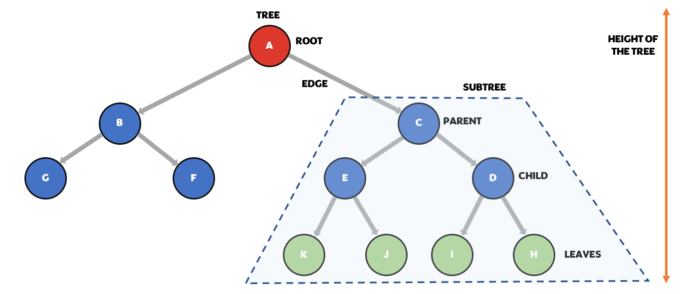
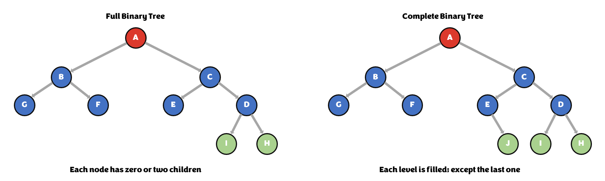
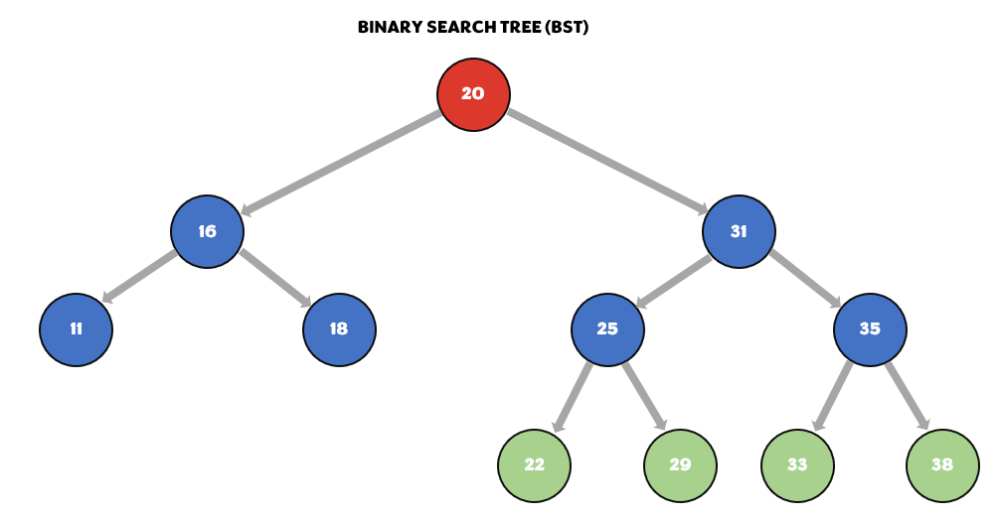
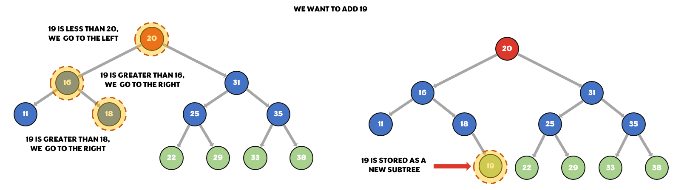
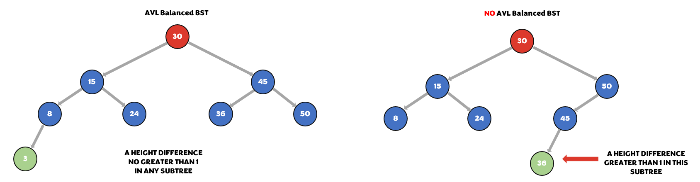
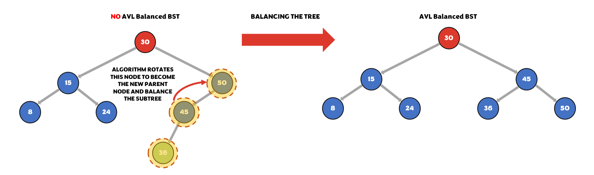
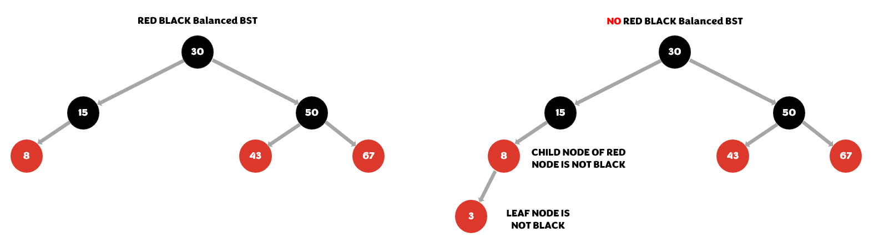
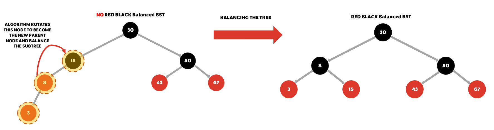

# Trees
While working with directories or file systems, we might occasionally be interested in organizing our data in a hierarchical order. We might want to have the most significant item or origin in the top and less relevant elements in sublevels. Most data structures provide a linear configuration to insert or arrange data; however, one of the data structures that allow the user to apply a hierarchical arrangement is called **Tree**. This organizational format works similar to a linked list due to it uses pointers, also called edges, to connect nodes. One big difference, though, is that this structure allows connecting more than one node to the tree at the same level. How this data structure grows is by creating branches where we can store more data, and each branch can have multiple branches just like a tree, hence the name. Next section provides more details on how this structure is formed.

<br> 

## Structure
There are several types of trees we could talk about; however, we will limit our study to only three of them. We would like to begin by introducing the binary trees. Unlike a general tree that can multiple nodes per level, a **binary tree** can only allocate two nodes per sublevel and each branch created by each of these two nodes can only have two other subnodes and so forth. Hence the name binary tree. The node from where our binary tree begins, origin or top, is commonly known as **root**. The branches created by the subnodes are called **subtrees**. Most of the nodes have a parent-child relationship. The subnode connected to an upper node is usually called **child** and the upper node to which the subnode is connected is called **parent**. Each child node, as mentioned previously, generally forms a subtree. Nodes that don't have any children are called **leaves**. The links used to connect one node to another are called **edges**; they are usually represented as arrows or lines in the diagrams. Another term that would relevant to define is the height of a tree. The **heigh of a tree** is the number of nodes through the path with the maximum number of nodes from the root to a leaf. Despite this definition only applies to the entire tree, the height of a subtree can be calculated in the same way. All of these elements can be observed in the Figure 4.

<br>


<figcaption align = "center"><b>Figure 5 - Binary Tree</b></figcaption>

<br>

A binary tree can also be classified into two other categories, a full binary tree and a complete binary tree. A **full binary tree** is when each node of the tree is restricted to have only zero or two children. A child per node is not allowed. A **complete binary tree** is when each level of the tree is entirely filled; the last level could be an exception to this rule. The Figure 5 shows some examples of these two subcategories.

<br>


<figcaption align = "center"><b>Figure 6 - Full Binary Tree / Complete Binary Tree </b></figcaption>

<br>

The second type of tree structure we will introduce is the **binary search tree (BST)**. This one has more restrictions than the one introduced previously. In a BST type of structure, data that is smaller than the parent node, starting at the root, is stored as a subtree in the left side, and data that is larger is stored as a subtree in the right side. Whenever we have data that is repeated, it can be added either to the right or left. BSTs are very efficient when it comes to searching for data because of its O(log n) performance. A O(log n) is a big O notation assigned to programs or data structures that have the performance of a base 2 logarithmic function. In other words, algorithms that are able to reduce the number of operations required to perform to the half each iteration. This is a property that allows the users to reduce the job by 50% at each level whene trying to find an empty spot to add data in a BST. The Figure 6 and 7 show a BST and its typical operation.

<br>


<figcaption align = "center"><b>Figure 7 - Binary Search Tree (BST) </b></figcaption>

<br>

<br>


<figcaption align = "center"><b>Figure 8 - BST Typical Operation </b></figcaption>

<br>

Finally, we want to introduce the type of tree structure called **balanced binary search tree (balance BST)**. This arrangement is based on a normal BST, except that includes some additional restrictions in order to keep our O(log n) performance. Something that could diminish this efficiency would be having a considerable height difference between two subtrees. Balance BST algorithms are able to detect such differences and correct them. **AVL** and **Red Black trees** are self-balance BST that implement some of these algorithms. AVL trees don't allow a height difference greater than one between any of its subtrees nodes. With Red Black trees, each node carries an extra bit to keep track of its color, red or black. The root node and leaf nodes can only be black, and whenever there is a red node, both of its children must be black. Every path should include the same number of black nodes. For both BST, the algorithm rotates the nodes to follow these rules. Following these rules prevents them from losing their O(log n) performance. The following figures show both types of balanced BST and their respective operation.

<br>


<figcaption align = "center"><b>Figure 9 - AVL Balanced BST </b></figcaption>

<br>

<br>


<figcaption align = "center"><b>Figure 10 - AVL Balanced BST Typical Operation </b></figcaption>

<br>

<br>


<figcaption align = "center"><b>Figure 11 - Red Black Balanced BST  </b></figcaption>

<br>

<br>


<figcaption align = "center"><b>Figure 12 - Red Black Balanced BST Typical Operation </b></figcaption>

<br>

In case you are interested in learning a bit more about how these BSTs work, the University of San Francisco developed some free programs to visualize the operation of these BSTs. Those programs can be found on these following links: 

[Binary Search Tree](https://www.cs.usfca.edu/~galles/visualization/BST.html)

[AVL Balanced BST](https://www.cs.usfca.edu/~galles/visualization/AVLtree.html)

[Red Black Balanced BST](https://www.cs.usfca.edu/~galles/visualization/RedBlack.html)

<br>

## How to Insert and Access Data From a Tree

Once we introduced these topics, we can now talk about how to insert, traverse and access to data from this data structure by using Python. Operations with BST results more complicated than with the other data structures due to Python does not a have a built-in BST class. Therefore, whoever wants to use this data structure needs to come out with their own class to perform these operations. In order to create a BST class, we need to implement recursion, so we need to take into the account the principles of base case and smaller problem. These principles allow us to stop the recursion whenever we reach the base case and reduce the our problem with every recursion.

<br>

### Create a BST and insert a new node in it
As mentioned before, a BST can be implemented with classes. We can create a class which contains this data structure with an inner class that holds the node information. This inner class can carry the node value and two pointers, one that points to the left node and another one that points to the right node. The upper class can also contain a attribute to create an empty BST. Within this upper class, we can create a function that can allow the user to insert new nodes to the BST. This function would initially check if the root node is empty, and if it's, it would add the new input value as the root. Within this function, we can called another function that will check for all the other cases and use recursion until it finds the right spot to insert the new node. The following code shows how to implement this operation:

<br>

```python
class BST:                         #Initialize a BST
    class Node:
        def __init__(self, data):  #Initialize a new node
            self.data = data
            self.left = None
            self.right = None
    
    def __init__(self):
        self.root = None            #Create a empty BST
    
    def insert(self, data):

        #If the root is empty, data becomes the BST root
        if self.root is Node:
            self.root = BST.Node(data)  

        else:
        #Otherwise call other method to deal with other cases
            self._insert(data, self.root)

    def _insert(self, data, node):
        #Go to the left whenever data is less than current node

        if data < node.data:
            #If node to the left is empty, initilize a new node
            if node.left is None:
                node.left = BST.Node(data)

            #Otherwise, use recursion to go to left node
            else:
                self._insert(data, node.left)

        #Go to the right whenever data is less than current node
        elif data >= node.data:

            #If node to the right is empty, initilize a new node
            if node.right is Node:
                node.right = BST.Node(data)

            #Otherwise, use recursion to go to right node
            else:
                self._insert(data, node.right)
        
```

<br>

### Accesing data from a BST
Whenever we want to access data from a BST we need to traverse all the nodes from the smallest to the largest or vice versa just like we did with linked lists. Doing so would allow us to implement a for loop to visit each node in the BST in case we want to do something with them. Before we show the code to do this, we need to explain some things about the methods and commands we will use to implement this operation. First, we would need to create a generator function. This type of functions are built-in methods from Python and allow the user to iterate through a collection of data and return values from the collection one at the time. These functions are also called iterators. `__iter__()` is the iterator we will use to traverse the BST. In addition to this, we will use a special command called `yield`. This command is similar to the `return` command except that instead of stoping the execution of the function, it only pauses the execution; it returns the value, and then the function resumes its program where it left off, maintaining the integrity of its local variables. The command `yield from` allows a function called within our `__iter()__` function to return its result. Having explained these things, we are ready to analyze the piece of code that makes this possible:

```python
# This declare our generator function. Allow to perform a for loop
def __iter__(self):
    yield from self._traverse_forward(self.root)

def _traverse_forward(self, node):
    # Check if the current node spot is not empty
    if node is not None:

        # Traverse the smaller numbers first
        yield from self._traverse_forward(node.left)

        # Return data from the current node
        yield node.data

        #Traverse the larger number last
        yield from self._traverse_forward(node.right)
```
These are only two of all the possible operations that can be performed with BST (remove, contain, height, size, empty, etc.). However, as Python does not have a built-in class to implement a BST, for all the other operations the user need to come out with their own class and code to implement them. For that same reason, we don't have the Python syntax section for BST. 

## Example: Restaurant Weekly Revenue Tracker Using a BST
In the example below, we will create a program that create a BST to allow a restaurant's owner to keep track of the weekly revenue and be able to calculate the total profit at the end of the year. The specifications for the program are the following:
* Allow the user to add new data (weekly revenue and week number)
* Allow the user to print the list with all the data (weekly revenue and week number) in descending order; from the week with highest revenue to the week with lowest revenue
* Allow the user to print the list with all the data (weekly revenue and week number) in ascending order; from the week with lowest revenue to the week with highest revenue
* Calculate the total annual profit for the restaurant, considering a fixed weekly cost of $3500
* Create a menu that allow the user to select the different operations that can be performed with a BST

```python
# Class that contains the Binary Search Tree
class BST_Revenue:
    # Subclass that contains the information for each node. In this case, each node
    # stores the information of the weekly revenue and week number
    class Biweekly_Revenue:
        def __init__(self, data, week):
            self.data = data            # Weekly revenue
            self.week = week            # Week number
            self.lesser = None
            self.greater = None
    
    # Initialize an empty BST
    def __init__(self):
        self.initial = None
    
    # Insert data to the BST. If the BST is empty, add new node at the root. 
    # Otherwise, use recursion to find where to add new node
    def add_data(self, data, week):
        if self.initial is None:
            self.initial = BST_Revenue.Biweekly_Revenue(data, week) # Insert new node at the root
        else:
            self._add_data(data, week, self.initial)  # Use recursion to find where to insert new node
    
    # Look for the right place where to insert the new node in the BST
    def _add_data(self, data, week, revenue):
        # Check if new node revenue is less than the current node revenue
        if data < revenue.data:
            # If node to the left of current node is empty, add new node there
            if revenue.lesser is None:
                revenue.lesser = BST_Revenue.Biweekly_Revenue(data, week)
            # Otherwise, use recursion to keep looking for where to add new node
            else:
                self._add_data(data, week, revenue.lesser)
        
        # Check if new node revenue is greater than the current node revenue
        elif data >= revenue.data:
            # If node to the right of current node is empty, add new node there
            if revenue.greater is None:
                revenue.greater = BST_Revenue.Biweekly_Revenue(data, week)
            # Otherwise, use recursion to keep looking for where to add new node
            else: 
                self._add_data(data, week, revenue.greater)   

    # Iterator function that will be called each time a 'for' loop is performed
    def __iter__(self):
        yield from self._traverse_forward(self.initial)

    # Allow to traverse forward the BST and return the values of each node from lowest revenue to highest revenue
    def _traverse_forward(self, revenue):
        # If current node is not empty, use recursion to return node information
        if revenue is not None:
            yield from self._traverse_forward(revenue.lesser)
            yield [revenue.data, revenue.week]
            yield from self._traverse_forward(revenue.greater)  
    
    # Perform a backward traversal. It gets called when the method _traverse_backward is called.
    def __reversed__(self):
        yield from self._traverse_backward(self.initial)

    # Allow to traverse backward the BST and return the values of each node from the highest revenue to the lowest revenue
    def _traverse_backward(self, revenue):
        # If current node is not empty, use recursion to return node information
        if revenue is not None:
            yield from self._traverse_backward(revenue.greater)
            yield [revenue.data, revenue.week]
            yield from self._traverse_backward(revenue.lesser) 

    # Determine the sum of the heights of all the subtrees. Total amount of weeks.
    def get_amount_of_weeks(self):
        # If root node is empty, return zero
        if self.initial is None:
            return 0
        # Otherwise, use recursion to find the sum of the heights of the subtrees
        else:
            return self._get_amount_of_weeks(self.initial) # Start at the root node

    # Return the sum of the heights of all the subtress. Total amount of weeks.
    def _get_amount_of_weeks(self, revenue):
        
        # Check if current node does not have nodes to the right and left
        if revenue.lesser is None and revenue.greater is None:
            return 1
        
        # Check if current node does not have node to the left
        elif revenue.lesser is None:
            return 1 + self._get_amount_of_weeks(revenue.greater)
        
        # Check if current node does not have node to the right
        elif revenue.greater is None:
            return 1 + self._get_amount_of_weeks(revenue.lesser)

        # Current node has nodes to the right and left
        else:
            x =  1 + self._get_amount_of_weeks(revenue.greater)
            y = 1 + self._get_amount_of_weeks(revenue.lesser)
        
        # Avoid counting double some of the nodes
        if x > y:
            y -= 1
        else:
            x -= 1

        return x + y

#Create a new BST
revenue = BST_Revenue()

exit_menu = "no"

# Create menu that allow user to perform different operations with the BST
while exit_menu == "no":
    request = 1
    print("Revenue Restaurant Menu: ")
    print("1) Add revenue of a specific week")
    print("2) Display data from highest weekly revenue to lowest")
    print("3) Display data from lowest weekly revenue to highest")
    print("4) Calculate profit")
    print("5) Exit")
    operation = int(input("\nSelect operation: "))

    # Add new node to the BST. Add new week with its respective revenue
    if operation == 1:
        while request == 1:
            week_number = int(input("\nPlease enter the week number for which you want to add the revenue: "))

            revenue_amount = int(input("\nPlease enter the revenue for that week? "))

            revenue.add_data(revenue_amount, week_number)
        
            request = int(input("\nDo you want to add another weekly revenue? (Enter 1 for yes and 0 for no): "))

    # Print the list with the weekly revenues of the whole year in descending order
    elif operation == 2:
        print("\nWeekly Revenue | Week Number")
        for x in reversed(revenue):
            print(f"    {x[0]}       |    {x[1]}")  
        print() 

    # Print the list with the weekly revenues of the whole year in ascending order
    elif operation == 3:
        print("\nWeekly Revenue | Week Number")
        for x in revenue:
            print(f"    {x[0]}       |    {x[1]}") 
        print() 

    # Calculate the annual profit of the restaurant
    elif operation == 4:
        amount_week = revenue.get_amount_of_weeks()
        fixed_cost = 3500
        total_revenue = 0
        for x in revenue:
            total_revenue += x[0]
        total_profit = total_revenue - (5000 * amount_week)
        print(f"\nThe total profit for your restaurant during this year is: ${total_profit}")

    # Exit the menu
    elif operation == 5:
        exit_menu = "yes"
    
    print()
```

<br>

In case you want to test this program, you can use the data found in the following table to print the list with data in descending or ascending order and calculate the restaurant profit for the first 26 weeks of the year.

| **Week Number** | **Weekly Revenue** |
|:---------------:|:------------------:|
|        1        |        $6500       |
|        2        |        $6230       |
|        3        |        $5210       |
|        4        |        $4300       |
|        5        |        $5100       |
|        6        |        $6375       |
|        7        |        $7800       |
|        8        |        $5650       |
|        9        |        $4020       |
|        10       |        $3800       |
|        11       |        $3901       |
|        12       |        $3300       |
|        13       |        $4520       |
|        14       |        $5200       |
|        15       |        $5250       |
|        16       |        $6700       |
|        17       |        $6921       |
|        18       |        $7346       |
|        19       |        $6867       |
|        20       |        $7593       |
|        21       |        $8001       |
|        22       |        $6274       |
|        23       |        $5128       |
|        24       |        $5024       |
|        25       |        $4324       |
|        26       |        $3452       |

## Problem to Solve

You can check your work with the solution here: [Solution](donation_BST.py)

[Back to Welcome Page](1-welcome.md)